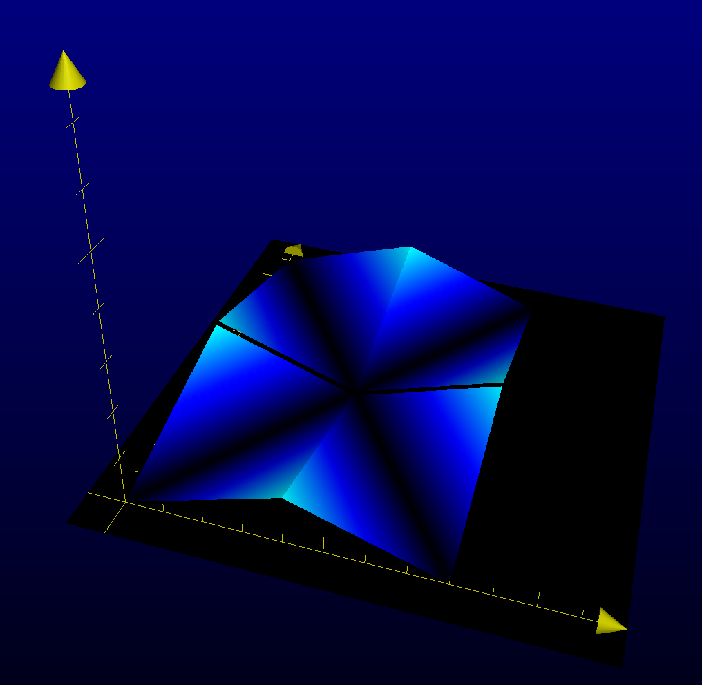

# Swipe Area Alpha Alogrithm

The following figure is an opacity map for gender tags and their background panels in the app's main interface.

The horizontal plane represents the xy plane of the mobile screen, and the vertical axis records the alpha value that we aim to calculate for each (x,y) point. The brightness of blue indicates the height for each point, which corresponds to the opacity ranging from 0 to 1.

Intuitively, the values on the map are assigned according to these two criteria:
1. The closer to the four borders, the more oqaque the targets (gender tags and colored background) should be. 
2. If the source object (the center of the word card) falls on the diagonal axes of the screen, it should be more transparent, as in this case the user is vague about their decision on where to swipe the card to.

